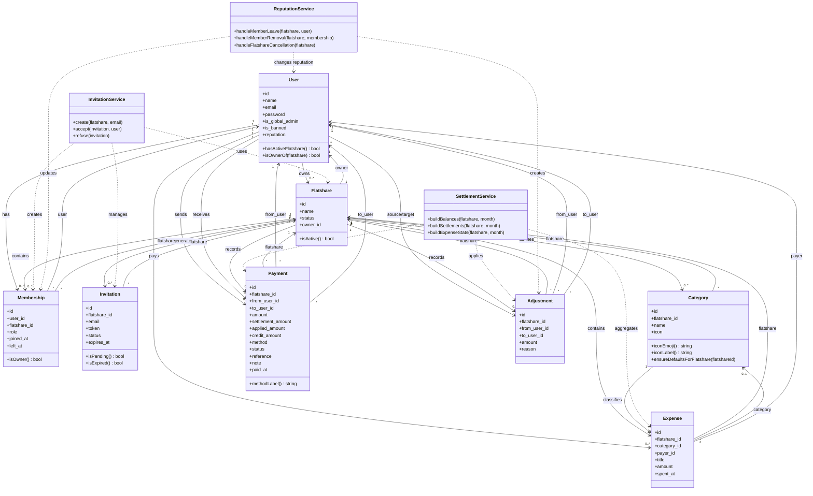
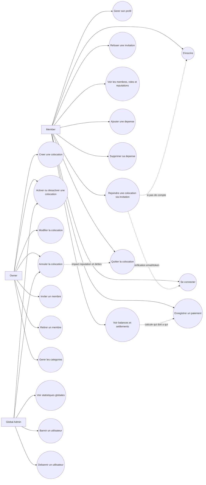

# CarnetPro Diagrams

Ce document contient un diagramme de classes et un diagramme de cas d'utilisation bases sur la structure actuelle du projet Laravel.

## Diagramme de classes

## Diagramme de cas d'utilisation

## Notes

- `Owner` est un utilisateur standard qui devient administrateur de sa colocation.
- `Global Admin` peut aussi etre `Owner` ou `Member` dans une ou plusieurs colocations.
- Le projet applique une contrainte fonctionnelle importante: un utilisateur standard ne peut avoir qu'une seule colocation active a la fois.
- Les diagrammes representent l'etat actuel du code, y compris les paiements, categories avec icones, invitations par token et reputation.
